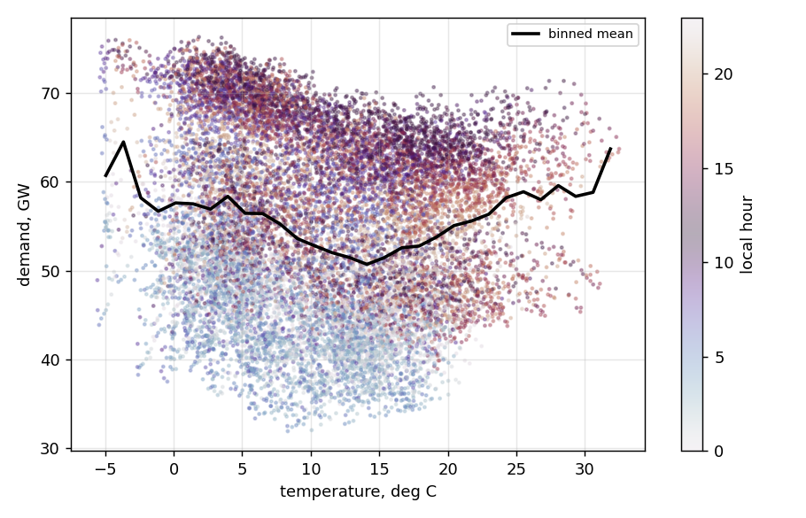

# Day-ahead load forecasting for Germany, and what weather data is worth to it

A day-ahead forecast of German hourly electricity demand, used to measure what
better weather information is actually worth.

Temperature enters through four switchable modes - `none`, `lagged`, `noisy`,
`perfect` - so the question gets a number rather than an assumption. `perfect`
is the ceiling: the most any weather model could contribute.

It depends on the season. Temperature is worth 13-16% in July and August and
nothing across winter, and the fold-to-fold range is about five times the mean
effect. Establishing that took a ten-seed study and a rolling-origin backtest;
the single-window number could not separate a real effect from a lucky draw.

Every number below regenerates from this code in the pinned environment.

Data: [OPSD](https://open-power-system-data.org/) time series (2020-10-06
release), German hourly load 2015-2020, plus ERA5 2m temperature (NetCDF, via
the Copernicus CDS).

---

## Results

Test period 2019-01-01 to 2020-09-30. Trained on 2015-2017, validated on 2018.
The models never see the test period.

| model | MAE (MW) | RMSE (MW) | MAPE | bias (MW) | skill vs naive |
|---|---:|---:|---:|---:|---:|
| **gradient boosting** | **1,201** | 1,623 | 2.27% | +258 | **0.503** |
| MLP (PyTorch) | 1,213 | 1,654 | 2.28% | +349 | 0.498 |
| ENTSO-E published forecast | 1,762 | 2,253 | 3.22% | **-608** | 0.271 |
| ridge | 1,837 | 2,526 | 3.48% | +287 | 0.240 |
| seasonal naive (168h) | 2,416 | 4,184 | 4.55% | -55 | 0 |
| mean of last 4 weeks | 2,648 | 4,134 | 4.94% | +75 | -0.096 |
| yesterday | 4,340 | 6,620 | 8.09% | -16 | -0.796 |

Skill score is `1 - MAE_model / MAE_naive`. Gradient boosting removes just over
half the seasonal-naive baseline's error.

The ENTSO-E row is the TSOs' own published day-ahead forecast, scored on the
same rows. Note its bias: it runs 608 MW low on average, which MAE hides
entirely. See Limitations for why this is not a like-for-like comparison.

### Bias is almost entirely COVID

The +258 MW annual bias is not a standing tendency to over-forecast. Split by
period:

| period | gbm | MLP | ENTSO-E |
|---|---:|---:|---:|
| 2019 (full year) | **+94** | +109 | -1,333 |
| 2020 Jan-Feb | **-25** | +116 | -130 |
| **2020 Mar-Jun** | **+917** | +1,163 | **+1,291** |
| 2020 Jul-Sep | +217 | +373 | -562 |

Under normal conditions the model is close to unbiased - +94 MW over a full year
is 0.17% of mean demand (54,729 MW). Essentially all of the annual bias comes
from March-June 2020, when demand fell and nothing trained on 2015-2018 could
have known. The TSOs' own forecast over-predicted by more in the same window
(+1,291 MW) despite a much shorter horizon, which is worth knowing before
treating any single bias number as a property of a model rather than of a period.

---

## Does weather help?

The more interesting question, and the answer is "depends on the season" rather
than yes or no.

Temperature enters through four switchable modes, so the value of *better*
weather information can be measured rather than assumed:

- `none` — no weather at all
- `lagged` — temperature from 24h+ ago only (honest: no future information)
- `noisy` — true temperature plus 1 degC Gaussian noise (stand-in for forecast error)
- `perfect` — exact temperature at the target hour (perfect prognosis: an upper bound, not achievable)

### Single test window, gradient boosting

| mode | MAE (MW) | vs none |
|---|---:|---:|
| none | 1,200.6 | — |
| lagged | 1,212.9 | +12.3 |
| noisy (seed 0) | 1,183.4 | -17.2 |
| perfect | 1,170.7 | -29.9 |

Perfect foreknowledge of temperature - an upper bound no weather model can reach
- buys 2.5%. `lagged` is *worse* than no weather at all: yesterday's temperature
adds noise the model has already extracted from yesterday's demand.

A single window and a single noise draw is not enough to trust any of this, so
it was checked two further ways.

### Does the gain survive reseeding?

`noisy` across ten random seeds, gradient boosting:

Mean 1,181.7 MW, std 4.1, range 1,174.5 to 1,185.5 - a spread of **11.0 MW**
against a mean gain of 18.9. It survives, but not by much. Seed 0, the default a
single run reports, lands 6th of ten: representative rather than flattering.

Reproduce with `--seed`:

```bash
for s in 0 1 2 3 4 5 6 7 8 9; do python run_comparison.py --weather noisy --seed $s --no-plots; done
```

The check matters more than its result: had the spread exceeded the gain, the
single-window number would have been noise reported as a finding.

### Across rolling folds

Rolling-origin backtest, gradient boosting, 6-month blocks:

| fold | test period | none | noisy | delta |
|---|---|---:|---:|---:|
| 1 | 2019 H1 | 1,276.2 | 1,310.5 | +34.3 |
| 2 | 2019 H2 | 1,024.1 | 979.8 | -44.4 |
| 3 | 2020 H1 | 1,301.4 | 1,302.0 | +0.6 |
| 4 | 2020 Q3 | 959.8 | 861.3 | -98.5 |

Mean -27.0 MW, but it helps clearly in only two folds of four, is neutral in a
third, and is worse in the first. The fold-to-fold range is 133 MW - five times
the mean effect. On this evidence "weather helps" is a claim about summer, not a
claim about the year.

### The effect is seasonal

Mean absolute error by month, test period:

| month | none | with weather | delta |
|---|---:|---:|---:|
| Jan | 1,214 | 1,367 | **+12.6%** |
| Feb | 1,031 | 1,015 | -1.5% |
| Mar | 1,428 | 1,491 | +4.4% |
| Apr | 1,578 | 1,528 | -3.2% |
| May | 1,395 | 1,403 | +0.6% |
| Jun | 1,254 | 1,222 | -2.6% |
| Jul | 922 | 802 | **-13.0%** |
| Aug | 1,061 | 887 | **-16.4%** |
| Sep | 970 | 983 | +1.4% |
| Oct | 1,042 | 1,133 | +8.7% |
| Nov | 1,065 | 1,032 | -3.1% |
| Dec | 1,379 | 1,269 | -7.9% |

**Summer (Jun-Aug): -109 MW. Winter (Nov-Mar): +11 MW.**

Temperature is worth 13-16% in July and August and nothing across winter on net.
January is 13% *worse* with weather and I have no explanation for it; possibly a
cold snap the noise handled badly, possibly overfitting.

### Why weather adds so little on average

Temperature is 96% autocorrelated at 24 hours:

| lag | corr with now |
|---|---:|
| 1h | +0.996 |
| **24h** | **+0.962** |
| 168h | +0.839 |

The strongest feature is `lag_24h`. Yesterday's demand already contains
yesterday's weather, and yesterday's weather is 96% of today's - so explicit
temperature largely re-delivers what the model has. On daily means:

```
corr(load today, temp today)      = -0.358
corr(load today, temp yesterday)  = -0.360
```

Yesterday's temperature predicts today's demand as well as today's does.

In winter the calendar carries the rest - it is cold every day, so "January at
18:00" is most of the answer. In summer the calendar cannot tell a cool August
from a hot one, so temperature earns its keep. Cooling degree hours (above
22 degC) are also active in only 5.5% of hours against 72% for heating: the
demand-temperature curve is a V with a thinly populated right arm.



The V is lopsided: steep below 0 degC, far shallower above the 15 degC minimum,
and almost no data past 25 degC to fit a cooling response to. The colouring is
local hour, and the vertical spread it produces is the point - hour of day moves
demand by over 20 GW, temperature by perhaps 10 GW across its whole range.

---

## Where this connects to AI weather models

The four modes are a forecast-value framework, which is the question asked of
GraphCast, Pangu-Weather and AIFS once the headline RMSE is in: the model
verifies better against analysis, but does the downstream decision improve?

The proper study swaps `noisy` for archived operational forecasts - IFS and an
AI model, same issue and valid times - and rescores under each. Only the
temperature series changes; none of the machinery here does.

What the numbers already say:

- **The ceiling is low on average.** `perfect`, unattainable by any model, buys
  2.5%. Temperature is 96% autocorrelated at 24h and `lag_24h` already carries
  yesterday's weather.
- **It is not low in summer.** July and August are 13-16%. A model that is
  better in a heatwave is worth more than its annual RMSE suggests.
- **Verification must be paired and multi-window.** The gain (19 MW) and the
  reseeding spread (11 MW) are the same order, and the effect is positive in
  only two folds of four.

Not claimed: these are gradient boosting and a small MLP over tabular features,
not weather models, and ERA5 is reanalysis - nothing here measures any
operational forecast's skill.

---

## Running it

```bash
pip install -r requirements.txt

python run_comparison.py                    # no weather
python run_comparison.py --weather noisy    # with weather
python run_comparison.py --backtest         # rolling-origin folds
python selfcheck.py                         # 13 correctness checks
```

`data/era5_temp_de.csv` is committed, so the weather modes run without a
Copernicus account. `python -m src.download_era5` regenerates the raw NetCDF if
wanted; that needs a free CDS account and is not required.

```
src/          data loading, features, models, evaluation, ERA5 download
data/         committed inputs - OPSD load extract, derived ERA5 series
results/      scores, predictions, backtest, figures/
selfcheck.py  13 correctness checks, synthetic data, no network
old-models/   the original single-file version, kept for reference
```

---

## What was checked

- **No lookahead, tested rather than asserted.** `selfcheck.py` spikes one value
  in the load series, rebuilds the features and asserts nothing within the next
  24 hours moved. The comparison is `>=`, not `>` — an earlier version used
  strict inequality, which would have permitted a feature reading the value *at*
  the poked hour.
- **Both weather directions.** `lagged` must not react within 24h; `perfect`
  *must* react at the target hour. Otherwise the two modes could quietly
  collapse into each other.
- **Fitting is independent of the test set.** Wrecking the test period by 7.5x
  and refitting leaves the trained MLP bit-identical.
- **Same rows for every model**, and the check that verifies this is itself
  tested — confirmed to fail when rows genuinely differ.
- **Calendar features are Europe/Berlin, not UTC.** Getting this wrong shifts
  every hour-of-day feature by 1-2 hours.
- **Holiday table validated** against the `holidays` package: 55/55 exact match
  for German national holidays 2015-2020, including the one-off Reformation Day
  in 2017.
- **Committed results reproduce bit-for-bit**, MLP included.

---

## Limitations

- **No forecast-origin structure.** A single assumed midnight cutoff, so there is
  no real lead-time verification. That needs issue time, valid time and lead time
  carried explicitly, with the same valid hour forecast from several origins. It
  also means error-by-hour cannot separate "forecast decays with horizon" from
  "afternoon load is harder".
- **The ENTSO-E comparison is not like-for-like.** Under Regulation 543/2013 the
  first day-ahead load forecast is published at least two hours before gate
  closure, around 10:00 on D-1 for Germany. This model assumes midnight, so it
  has roughly fourteen more hours of demand data. OPSD keeps target timestamps
  but no forecast vintage, so a given value may be a later revision. Reported
  because it is the right thing to measure against, not as a win.
- **One national temperature number**, an unweighted average over a box that
  includes the North Sea and part of Poland. A land mask or population weighting
  would be better.
- **No wind or solar.** Load is only half the picture in a renewables-heavy grid.
- **Fold results are not independent.** Folds share training data and load is
  serially correlated, so 2-of-4 is a weak stability signal, not four coin
  flips. A Diebold-Mariano test on paired errors would be the proper check.
- **ERA5 is reanalysis, and `noisy` understates its own uncertainty.** ERA5 is
  the best estimate of what the weather *was*. The synthetic error on top of it
  is independent hour to hour, so `temp_roll_mean_24h` averages it from 1.00 to
  0.21 degC (measured; 1/sqrt(24)); real forecast error is autocorrelated and
  does not. AR(1) error at phi=0.95, same marginal sigma, barely moves the mean
  gain (-16.1 MW against -18.9) but doubles the spread across draws (23.1 against
  11.0) - under a realistic error structure the spread exceeds the effect. The
  point estimate survives; the confidence in it does not. An archived
  operational forecast is the real fix.
- **Day-of-year is encoded on a 365-day cycle**, so leap years drift by one day
  in the seasonal sine and cosine. The effect is negligible but it is wrong.
- **The test period contains COVID.** No model trained on 2015-2018 was going to
  handle spring 2020.
- **Reproducibility is pinned, not guaranteed.** Versions are pinned in
  `requirements.txt`; different BLAS or hardware can still shift the last digits.

---

## Bugs found and fixed after review

- **Silent early stopping.** scikit-learn's `HistGradientBoostingRegressor`
  defaults to `early_stopping="auto"`, which switches itself on above 10,000 rows
  and carves an internal 10% validation slice out of training data. With 25,800
  rows it was active without my knowing, so `max_iter=600` was really running ~95
  iterations and the grid over [300, 600] was tuning a parameter the model
  ignored. Now explicitly off, so the external validation fold is the only one.
- **UTC vs local time.** Calendar features were built on UTC timestamps. Germany
  is UTC+1/+2, so every hour-of-day and is-weekend feature was offset.
- **Leakage test off by one.** The perturbation check used `>` where it needed
  `>=`, so a feature using the value at the poked hour would have passed.
- **NetCDF multi-file read.** `xarray.open_mfdataset` needs dask, which is not a
  dependency; the single-file path masked it. Files are now opened individually
  and concatenated.
- **Two worst days are both Corpus Christi** (2019-06-20, 2020-06-11) — a public
  holiday in some German states but not all, so it is absent from the national
  list and treated as a working day. Plausible but unconfirmed; the ablation that
  would prove it has not been run.
