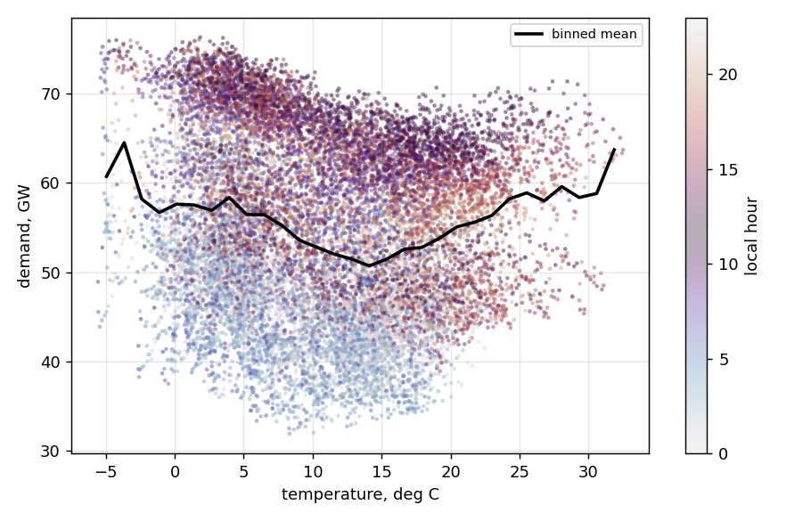

# Day-ahead load forecasting for Germany, and what weather data is worth to it

Forecasts German hourly electricity demand for the next day, and measures what
better weather information would actually be worth to that forecast.

The forecast for day D is made at 10:00 on D-1. That is when the TSOs publish
their own day-ahead load forecast, two hours before the day-ahead auction
closes, so it is when a forecast like this is actually needed, and it puts the
TSO forecast on equal terms. The first version of this repo forecast at
midnight instead, which is too late for the auction and quietly gave the model
about 14 hours more data than the TSOs had. [What that cost](#midnight-vs-1000)
is further down.

Data: [OPSD](https://open-power-system-data.org/) time series (2020-10-06
release), German hourly load 2015-2020, plus ERA5 2m temperature (NetCDF, via
the Copernicus CDS). Every number here regenerates from this code in the pinned
environment. The longer workings are in [ANALYSIS.md](ANALYSIS.md).

---

## Results

Test period 2019-01-01 to 2020-09-30. Trained on 2015-2017, tuned on 2018. The
test period is never used to fit or tune anything. No weather in this table.

| model | MAE (MW) | RMSE (MW) | MAPE | bias (MW) | skill vs naive |
|---|---:|---:|---:|---:|---:|
| **gradient boosting** | **1,259** | 1,654 | 2.34% | +189 | **0.479** |
| MLP (PyTorch) | 1,334 | 1,755 | 2.49% | +718 | 0.448 |
| ridge | 1,668 | 2,287 | 3.17% | +183 | 0.310 |
| ENTSO-E published forecast | 1,762 | 2,253 | 3.22% | -608 | 0.271 |
| seasonal naive (168h) | 2,416 | 4,184 | 4.55% | -55 | 0 |
| mean of last 4 weeks | 2,648 | 4,134 | 4.94% | +75 | -0.096 |
| same hour two days ago | 7,075 | 9,354 | 13.28% | -32 | -1.928 |

Skill is `1 - MAE_model / MAE_naive`, where naive is the same hour one week
earlier. "Same hour two days ago" replaces the usual "same hour yesterday"
baseline, because at 10:00 most of yesterday hasn't been published yet. It's
terrible because two days before a Monday is a Saturday.

Gradient boosting has the lowest error on this split. The MLP is behind, but
not by enough to call (Diebold-Mariano on the daily errors, p = 0.09), and in
the rolling backtest, where every model is refitted every six months, the MLP
wins three folds out of four. On this single split it runs high, +718 MW on
average and more than +1,000 MW from March 2020 on.

### Against the TSO forecast

The ENTSO-E row is the TSOs' published day-ahead load forecast, scored on the
same hours. It comes out around 10:00 on D-1, the same time as this model, so
on timing this is a fair comparison: 1,259 MW against 1,762, and a
Diebold-Mariano test on the daily errors puts the gap well beyond chance
(p < 1e-9).

Most of the gap is level rather than shape, though. The TSO forecast runs
608 MW low on average, and its monthly bias swings between 3.1 GW too low and
1.8 GW too high. Take each forecast's own monthly average error out and the gap
drops from 503 MW to 113 (1,220 against 1,333), so about 78% of it is level. It
also isn't consistent. In July-September 2020, when the TSO bias was small,
their forecast was better than mine, and that one is significant too
(p = 0.03):

| period | gradient boosting | TSO forecast |
|---|---:|---:|
| 2019 H1 | 1,326 | 2,438 |
| 2019 H2 | 1,084 | 1,548 |
| 2020 H1 | 1,401 | 1,683 |
| 2020 Jul-Sep | 1,193 | **1,017** |

Two more caveats. OPSD keeps the target time of each TSO value but not when it
was published, so some values may be later revisions rather than the 10:00
forecast. And the published number is a transparency requirement, not
necessarily the forecast the TSOs run the grid on.

So the fair summary is: at the same issue time, a no-weather model on public
data has a lower error than the published TSO forecast over 2019-2020, mostly
because that forecast's level is unreliable, and not in every period.

---

## Does weather help?

Temperature goes in through four modes, so its value is measured rather than
assumed:

- `none` - no weather
- `lagged` - only temperature already measured by 10:00 on D-1
- `noisy` - the actual temperature at the target hour plus 1 °C of random
  error, standing in for a forecast
- `perfect` - the actual temperature at the target hour, as an upper bound

The temperature is ERA5, which is a reanalysis: ECMWF's reconstruction of what
the weather actually was, put together days afterwards. Nobody had it at 10:00
on D-1. So `noisy` and `perfect` are not forecasts. They bound what a forecast
could be worth. The real number needs archived operational forecasts with
their issue times, which I haven't got.

Gradient boosting, single test window:

| mode | MAE (MW) | vs none |
|---|---:|---:|
| none | 1,258.6 | |
| lagged | 1,230.4 | -28.2 |
| noisy (seed 0) | 1,195.9 | -62.7 |
| perfect | 1,198.8 | -59.8 |

Knowing tomorrow's temperature exactly is worth about 5%. In the original
midnight setup it was worth 2.5%. At midnight the model had nearly all of
yesterday's demand, which already carries yesterday's weather; at 10:00 it
doesn't, so temperature has more to add. That is also why `lagged` now helps a
little, where at midnight it made things slightly worse.

`noisy` and `perfect` come out the same. Across ten noise seeds `noisy` lands
between 1,186 and 1,216 MW, and `perfect` sits inside that range, so 1 °C of
independent hourly error costs nothing this setup can measure. That says more
about the error model than about forecasts. Independent hourly errors mostly
cancel in the 24-hour rolling temperature; real forecast errors are correlated
from hour to hour and don't.

Checked two more ways ([details](ANALYSIS.md#does-the-weather-gain-hold-up)):

- Ten seeds: the mean gain is 56 MW against a seed-to-seed spread of 30 MW.
- Rolling folds: weather helps in all four six-month folds, by 84 MW on average.

Most of the gain is in summer: -11% in June to August against -3% from
November to March. Three months come out worse with weather: January by 10%,
May and October by about 4%.



Hour of day moves demand by over 20 GW, and temperature by maybe 10 GW across
its whole range, which is the ratio a temperature feature is up against. The
black line (the average in each temperature bin) rises again on the warm side,
but that is mostly time of day: the hottest hours are afternoon hours, when
demand is high anyway. On daily averages for working days, demand climbs about
8 GW from 15 °C down to below -5 °C, and only about 1.5 GW from 20 °C up to the
hottest days.

---

## Holidays

The first version only knew national holidays. Its two worst days in the test
period were both Corpus Christi, which is a public holiday in six states with
about 64% of the population but not nationally, so the model treated it as an
ordinary Thursday. All Saints' Day did the same thing on a smaller scale.

Each day now gets the share of the population that has a public holiday (from
the `holidays` package, weighted by state population), the same for the days
the lags look back to (1, 2 and 7 days earlier), and a flag for 24-31 December.

Daily MAE on the two Corpus Christi days, gradient boosting:

| day | national holidays only | with regional |
|---|---:|---:|
| 20 June 2019 | 8,117 | 912 |
| 11 June 2020 | 8,203 | 1,806 |

Over the whole test period it takes 40 MW off (1,298 to 1,259), about two
thirds of what perfect temperature is worth.

The worst days now are mostly spring 2020 (9 April, Maundy Thursday in the
first lockdown, and 24 March), Easter Sunday 2019, 20 December 2019 and
7 January 2020. One I can't explain: Monday 30 September 2019, where the
actual load looks completely normal and the model was about 4 GW low all day.

---

## Midnight vs 10:00

Same models, same features, same regional holidays. Only the forecast time
changes.

| | midnight | 10:00 on D-1 |
|---|---:|---:|
| gradient boosting | 1,160 | 1,259 |
| MLP | 1,208 | 1,334 |
| ridge | 1,695 | 1,668 |

Moving to 10:00 costs gradient boosting 98 MW, or 8.5%. That is the price of
not seeing the last 14 hours of D-1.
`--issue midnight` still runs the old setup, and with `--holidays national` as
well it reproduces the original published table exactly (1,200.6 MW).

---

## Where this connects to AI weather models

The four modes are a small forecast-value framework. It is the question
GraphCast, Pangu-Weather and AIFS get asked once the headline RMSE is in: the
forecast verifies better, but does the decision downstream get better? The
proper study swaps `noisy` for archived operational forecasts (IFS and an AI
model, same issue and valid times) and rescores. Only the temperature series
would change.

What the numbers here already say:

- The ceiling is modest on average, about 5%, but not in summer, where July
  and August gain 12-17%.
- Comparing weather inputs needs paired, multi-window testing. One noise draw
  moves the result by up to 30 MW, half the size of the effect.

These are gradient boosting and a small MLP on tabular features, not weather
models, and ERA5 is reanalysis, so nothing here measures any operational
forecast's skill.

---

## Running it

```bash
pip install -r requirements.txt

python run_comparison.py                       # forecast at 10:00 on D-1, no weather
python run_comparison.py --weather noisy       # with weather
python run_comparison.py --backtest            # rolling-origin folds
python run_comparison.py --issue midnight      # the original midnight setup
python run_comparison.py --holidays national   # without the regional holidays
python selfcheck.py                            # 17 correctness checks
```

`data/era5_temp_de.csv` is committed, so the weather modes run without a
Copernicus account. `python -m src.download_era5` regenerates the raw NetCDF if
wanted; that needs a free CDS account and is not required.

```
src/          data loading, features, models, evaluation, ERA5 download
data/         committed inputs - OPSD load extract, derived ERA5 series
results/      scores, predictions, backtest, figures/
ANALYSIS.md   bias, the TSO comparison, seeds, folds, months, limitations
selfcheck.py  17 correctness checks, synthetic data, no network
old-models/   the original single-file version, kept for reference
```

---

## Bugs found and fixed

- **Forecast time.** The first version forecast at midnight, so it used load up
  to 23:00 on D-1. That is too late for the day-ahead auction and about 14 hours
  more data than the TSO forecast it was compared with. The default is now
  10:00 on D-1.
- **A leak the leakage test missed.** While moving to 10:00, a version of the
  `lagged` temperature still used yesterday afternoon's temperature, which
  hasn't been measured at 10:00. The old test poked one hour, that hour happened
  to be in the morning, and it passed. With a 10:00 issue time what a row may
  see depends on its hour, so the test now pokes every hour of a whole day, and
  it is itself checked against a feature that is deliberately leaky.
- **Silent early stopping.** scikit-learn's `HistGradientBoostingRegressor`
  defaults to `early_stopping="auto"`, which switches itself on above 10,000
  rows and carves an internal 10% validation slice out of the training data.
  With 25,800 rows it was on without my knowing, so `max_iter=600` was really
  running about 95 iterations and the grid over [300, 600] was tuning a
  parameter the model ignored. It's now explicitly off.
- **UTC vs local time.** Calendar features were built on UTC timestamps.
  Germany is UTC+1/+2, so every hour-of-day and weekend feature was offset.
- **Leakage test off by one.** The perturbation check used `>` where it needed
  `>=`, so a feature using the value at the poked hour would have passed.
- **NetCDF multi-file read.** `xarray.open_mfdataset` needs dask, which isn't a
  dependency, and the single-file path hid it. Files are now opened one at a
  time and concatenated.

---

## Known limits

One issue time per day, so no real lead-time verification. That needs the same
valid hour forecast from several issue times. The TSO values may include later
revisions. ERA5 is reanalysis, and `noisy` understates real forecast error. One
national temperature, an unweighted average over a box that includes the North
Sea. No wind or solar. COVID is in the test period. [Full list, with the
measurement behind each](ANALYSIS.md#limitations).
